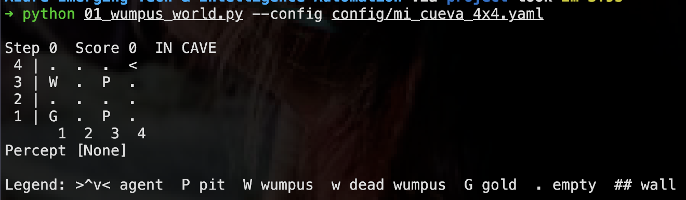
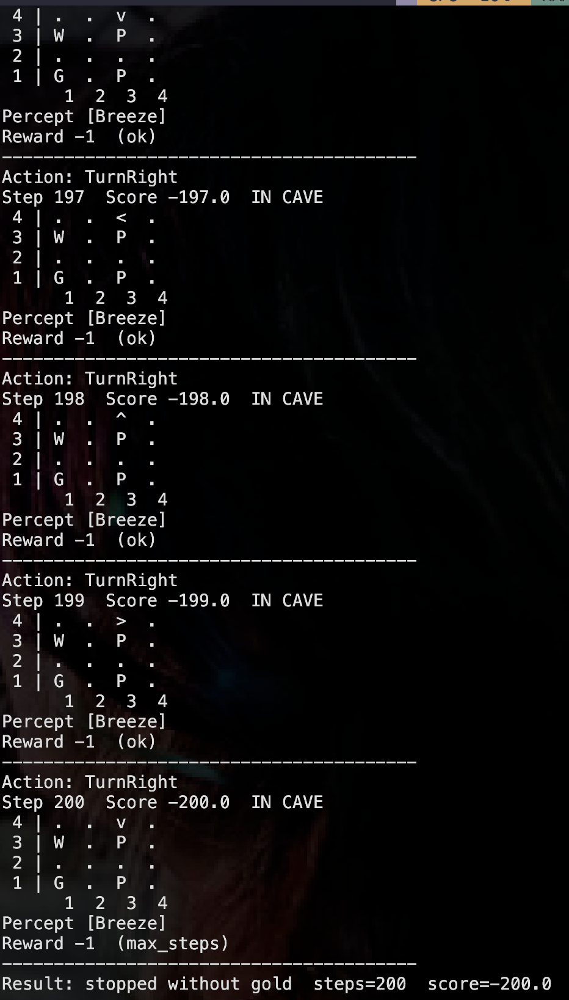
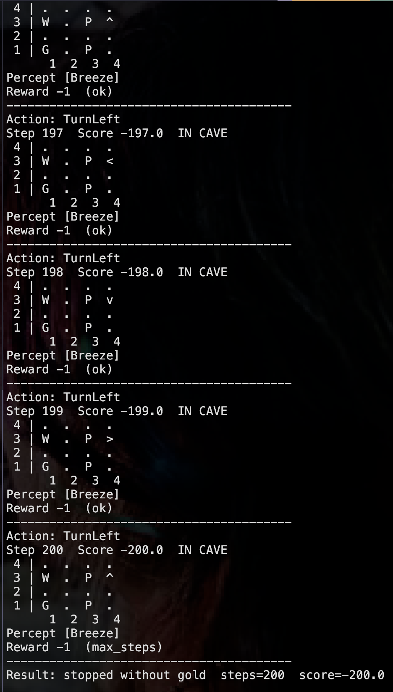
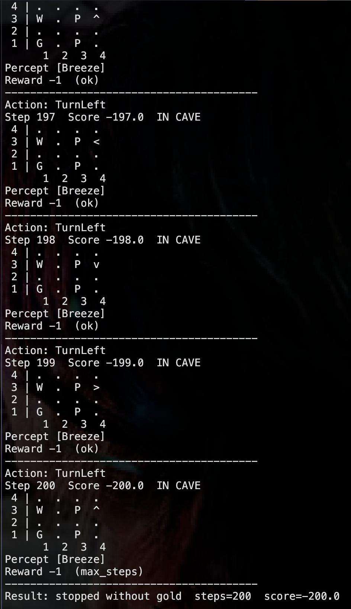
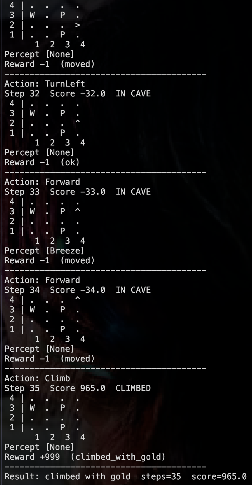
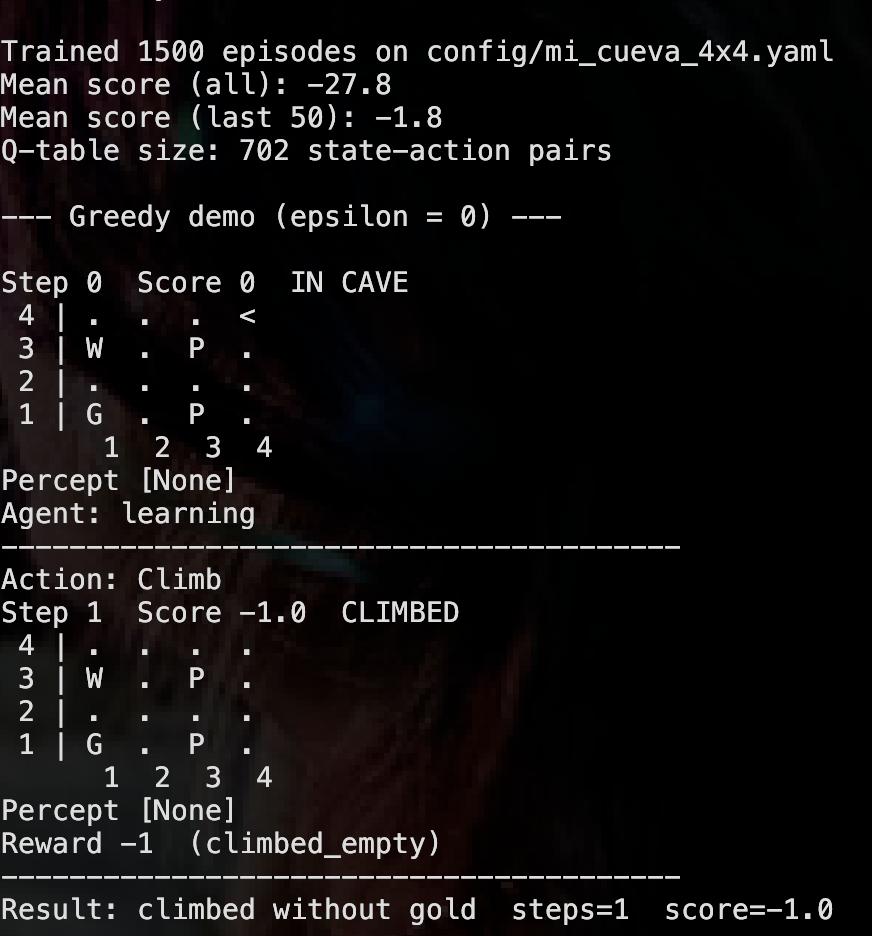
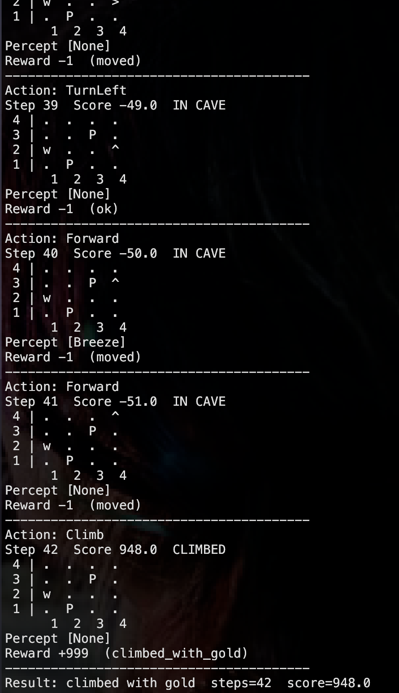

Al realizar estas tareas, tuve la oportunida de crear dos configuracion, un sencilla y otra más dificil:

1. Configuración facil:

El archivo de configuración de la version fácil es esta: [Configuracion sencilla](./config/mi_cueva_4x4.yaml)

la cual creaba un mundo como este:



A pesar de ser un mundo bastante simple, el poner un PIT cerca de la salida, hace que el agente tenga que pensar un poco más antes de salir, y esto ocasiona que vairios de los agntes o mejor dicho de los programas de python que se estan corriendo, no encuentran una solucion solida al tener que pensar más, aca proporciono, imagnges de los resultados.

1. Agente de reflejo simple

```
python 02_simple_reflex_agent.py --config config/mi_cueva_4x4.yaml
```

Resultados del agente de reflejo simple:



2. Agente basado en modelo

```
python 03_model_based_agent.py  --config config/mi_cueva_4x4.yaml
```

Resultados del agente basado en modelo:



3. Agente basado en metas

```
python 04_goal_based_agent.py   --config config/mi_cueva_4x4.yaml
```

Resultados del agente basado en metas:



4. Agente basado en utilidades

```
python 05_utility_based_agent.py --config config/mi_cueva_4x4.yaml
```

Resultados del agente basado en utilidades



5. Agente basado en apredizaje

```
python 06_learning_agent.py --episodes 1500 --config config/mi_cueva_4x4.yaml
```

Resultados del agente basado en aprendizaje



El que mejor me estuvo funcionando esta prueba fue el de basado en utilidades junto al de modelos en alguna de las pruebas y me sorprendio que el de aprendizaje no me dio buenos resultados, ya que en la mayoria de las pruebas no encontro una solucion solida y se quedo atrapado en el mundo, principalmente me di cuenta que preferia irse sin nada, ya que era el score más bajo que encontrar el ora, pero al modificar el epsilon a un .5 con un poco más de episodios ahi si encontraba la salida de manera más solida.

Por otro lado tambien cree una configuracion más dificil, la cual es esta: [Configuracion dificil](./config/mi_cueva_6x6.yaml) y el resultado es este:



En donde el unico que me lo logro resulver fue el basado en utilidades.
