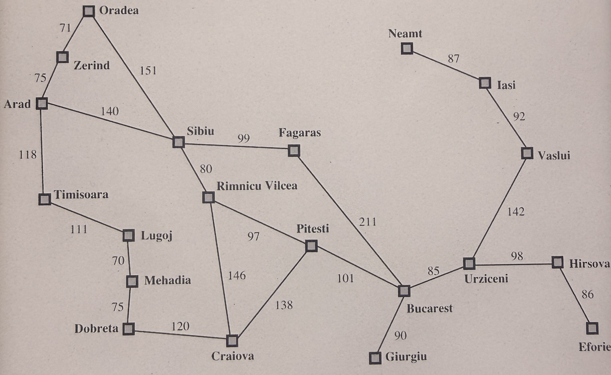
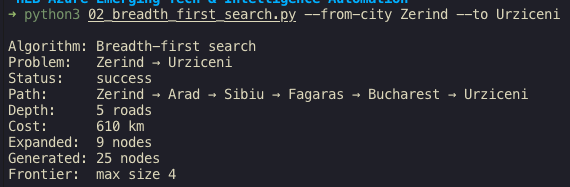
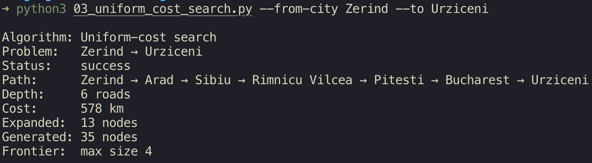
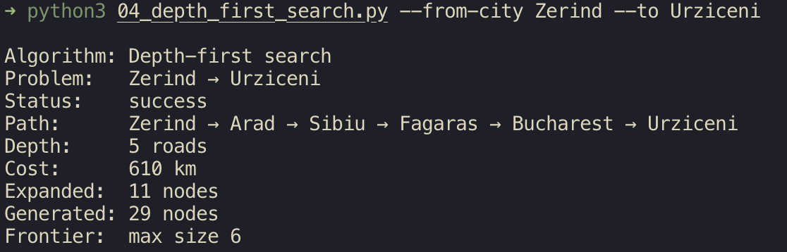
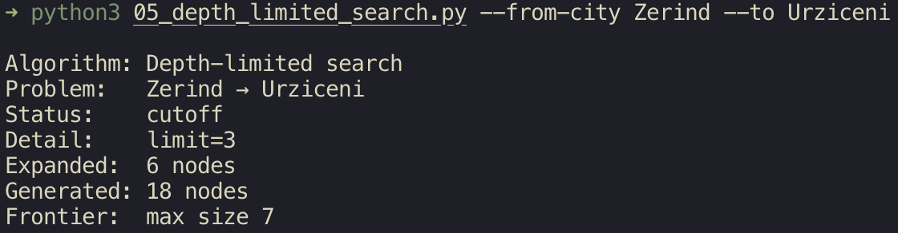
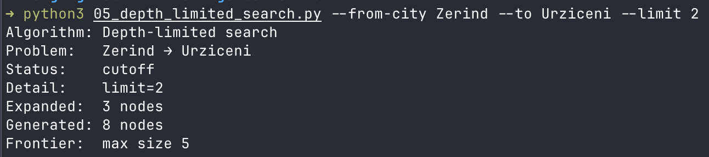
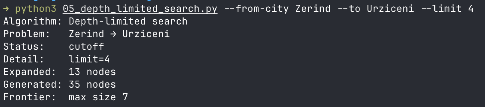
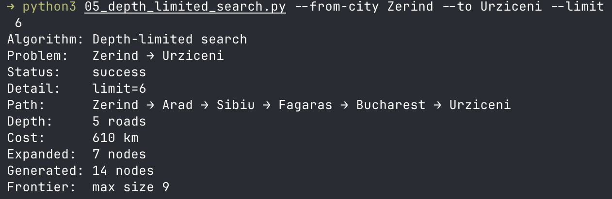
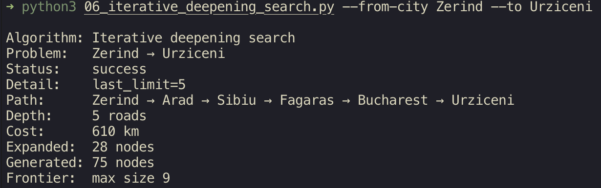

# Ejercicio 1 - Algoritmos de búsqueda no informada

Para este ejercicio de encontrar las mejores rutas de un lugar a otro, se seleccionaron 2 ciudades.

La ciudad de  origen fue: Zerind  y como ciudad destino: Urziceni

El mapa en cuestión es este;

Los resultados de los algoritmos son los siguientes:

1. **Bread first search**

En este más que buscar la ruta más optima, nos enfocamos en buscar la ruta con la menor cantidad de nodos, lo resultados de esta fueron los siguientes:

Como podemos observar, hizo el recorrido con la menor cantidad de nodos, pero no se fijo en el peso,  como vemos al inicio, se fue de zerind a arad, cuando la mejor opción debio ser Oradea.

2. **Unit Cost Search**

Ahora, al contrario del primero, este busca la ruta con el menor peso, como podemos observar, este hizo el recorrido correcto.

3. **Depth first search**

Se mete lo más profundo posible antes de retroceder. No es óptimo (puede encontrar una ruta larga).Se peude ciclar definitivamente que es lo malo.

4. dls.py — Depth-Limited Search (Fig. 3.17)

Es DFS pero con un límite de profundidad (limit). Implementado recursivamente. Si se llega a profundidad 0 sin meta, retorna CUTOFF (corte, no falla definitivamente, solo dice "no sé, no pude profundizar más"). Como podemos ver, en la imagnes de prueba, el estuvimos modificando los limites, hasta que con un limite de 6, este si puede ser viable usar, si bien no encontró la mejor ruta, si encontró una ruta, y no se quedo en CUTOFF.

5. ids.py — Iterative Deepening Search (Fig. 3.18)

Llama a depth_limited_search con limit = 0, 1, 2, 3, ... hasta que ya no dé CUTOFF. Combina lo mejor de ambos mundos: la optimalidad/completitud en hops de BFS, con el bajo uso de memoria de DFS (porque en cada iteración solo mantiene una rama en memoria, no todo un nivel). Acumula las métricas de todas las iteraciones anteriores.

------------------------------------------------------

Estas es la tabla comparativa de los algoritmos de búsqueda no informada:

| Algoritmo | Path | Profundidad | Costo | Expandido |
|---|---|---|---|---|
| Breadth First Search | Zerind → Arad → Sibiu → Fagaras → Bucharest → Urziceni | 5 | 610 | 9 |
| Unit Cost Search | Zerind → Arad -> Sibiu -> Rimnicu Vilcea -> Pitesti -> Bucharest -> Urziceni  | 6 | 578 | 13 |
| Depth First Search | Zerind → Arad → Sibiu → Fagaras → Bucharest → Urziceni | 5 | 610 | 11 |
| Depth Limited Search | CUTOFF | 0 | 0 | 6 |
| Iterative Deepening Search | Zerind → Arad → Sibiu → Fagaras → Bucharest → Urziceni | 5 | 610 | 28 |
