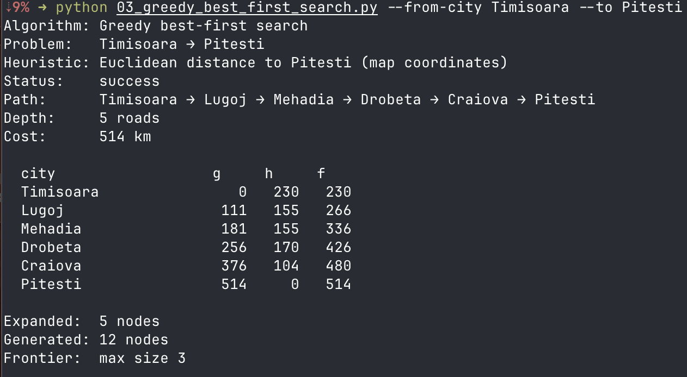
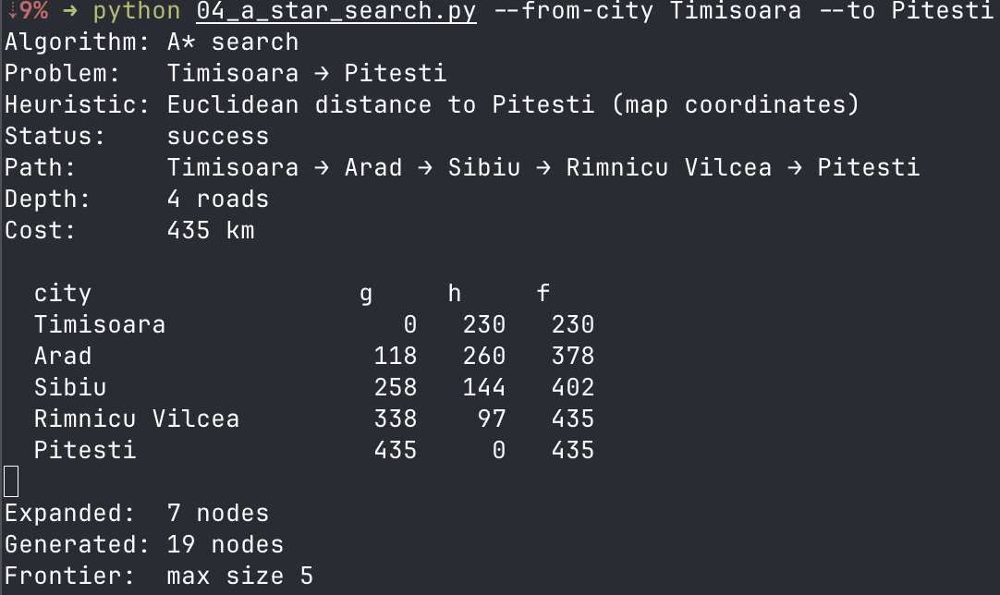

# Ejercicio 1 — Comparar Greedy y A* en el mapa de Rumania

Para este ejercicio, vamos a comparar los algoritmos de búsqueda Greedy y A* utilizando el mapa de Rumania como ejemplo. El objetivo es encontrar la ruta más corta desde la ciudad de Timisoara hasta la ciudad de Pitesti. Los resultados son los siguientes:

1. Algoritmo de Greedy

Como se peude ver el algoritmo de Greedy al exclir g(n) este se va por el h(n) más chico, es por esto que se va por lugoj y no por asad a diferencia de A* que si toma en cuenta g(n) y h(n) y por eso se va por arad.

2. Algoritmo A*

Como se puede ver en el algoritmo A*, este toma en cuenta tanto g(n) como h(n), lo que le permite encontrar la ruta más corta de manera más efectiva en comparación con el algoritmo Greedy. A* evalúa todos los nodos y elige el que tiene el costo total más bajo, lo que le permite encontrar soluciones óptimas en muchos casos.

El grafo quedaria de la siguiente manenera:

  TIMISOARA ───────── ARAD ───────── SIBIU ───────── R.VILCEA ───────── PITESTI
      (h=230)   \        (h=260)        (h=144)          (h=97)       /   (h=0)
                 \                                       |          /
              111 \                                  146 |        / 138
                    \                                    |      /
                   LUGOJ ─── MEHADIA ─── DROBETA ─── CRAIOVA  /  
                   (h=155) 70 (h=155) 75 (h=170) 120 (h=104)
