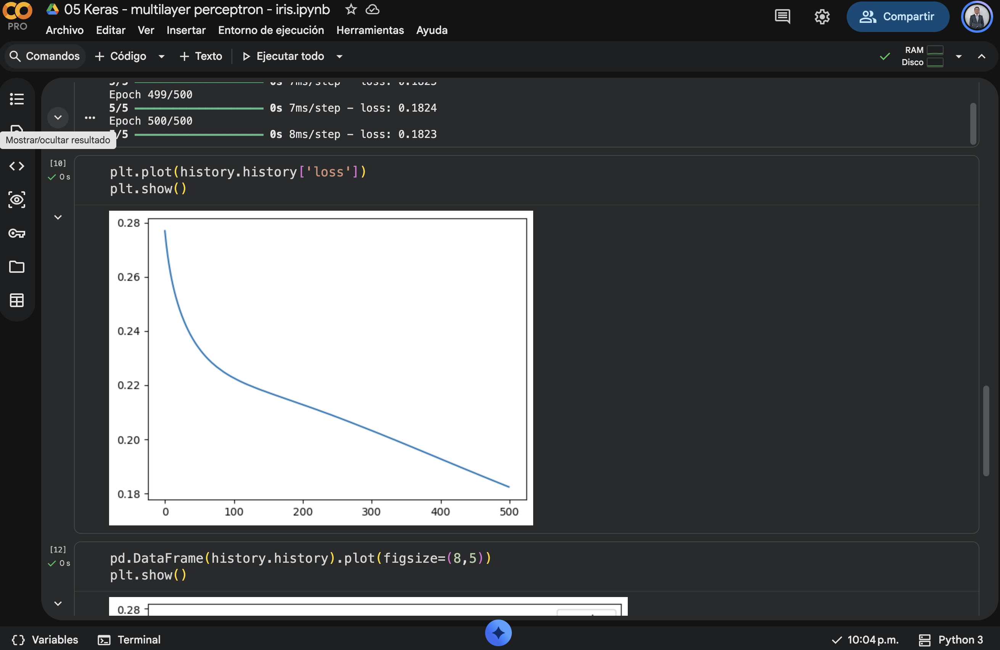
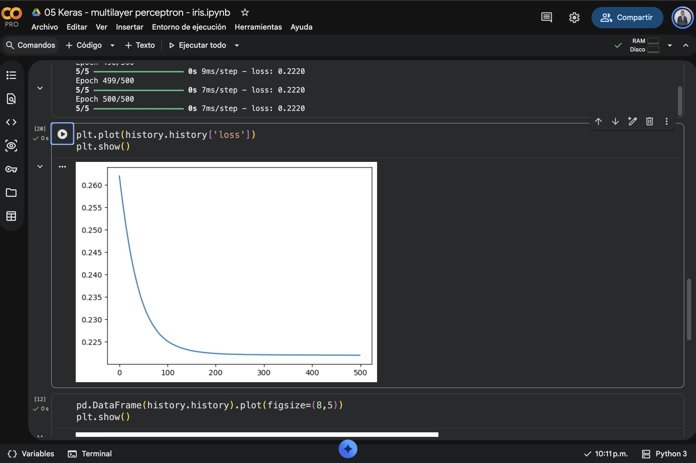
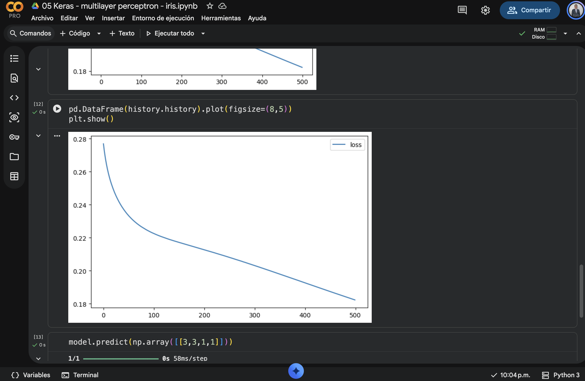
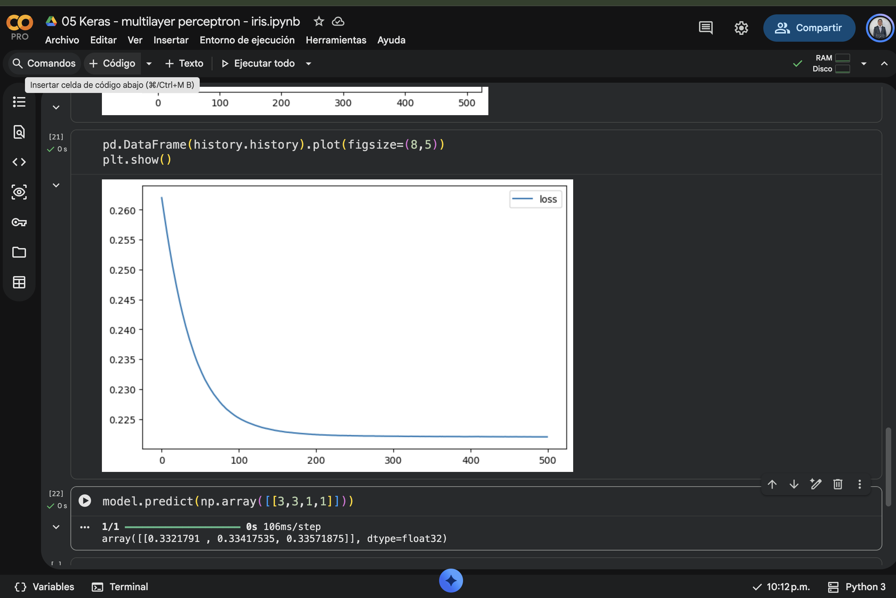
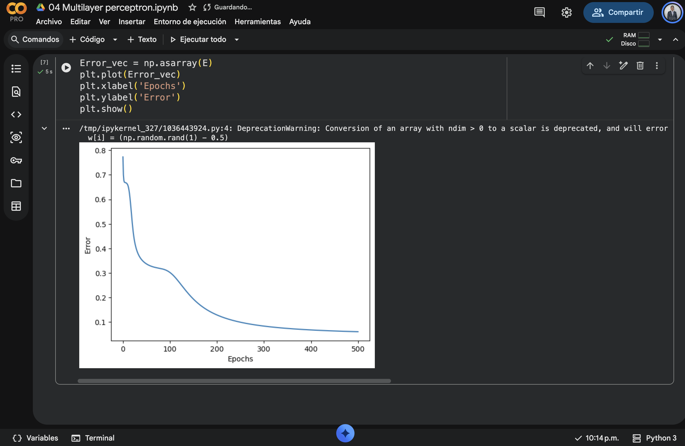
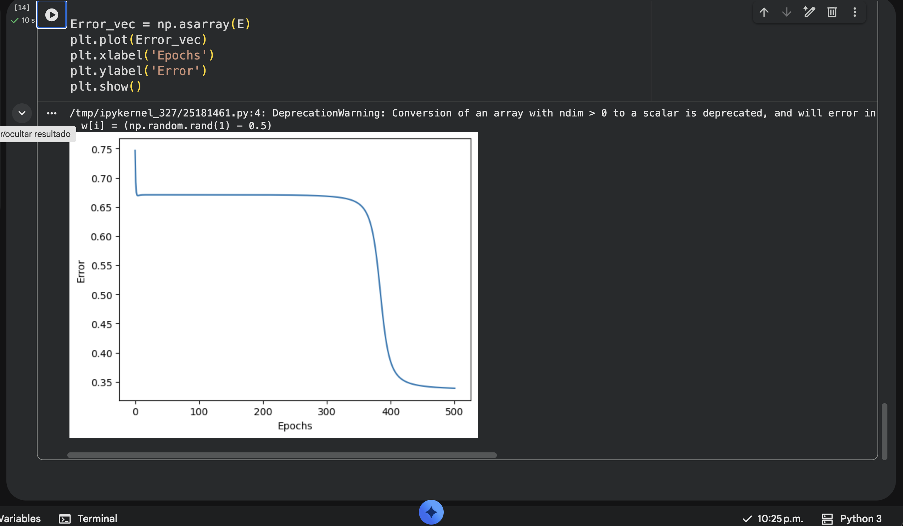

## Anexos

### Notebooks

- [04_Multilayer_perceptron.ipynb](assets/notebooks/04_Multilayer_perceptron.ipynb)
- [05_Keras_multilayer_perceptron_iris.ipynb](assets/notebooks/05_Keras_multilayer_perceptron_iris.ipynb)

### Imágenes

