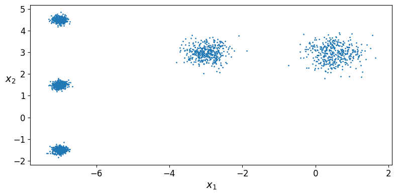
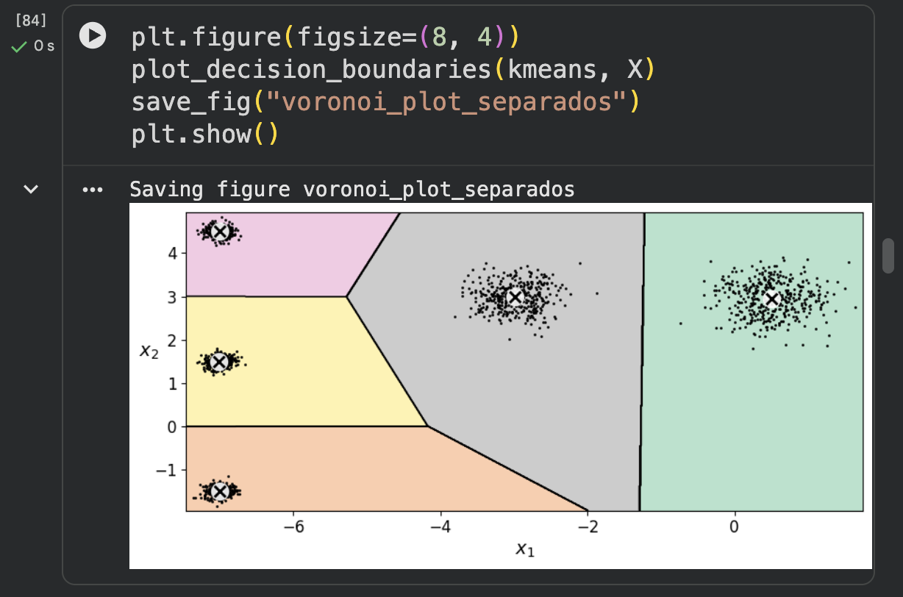
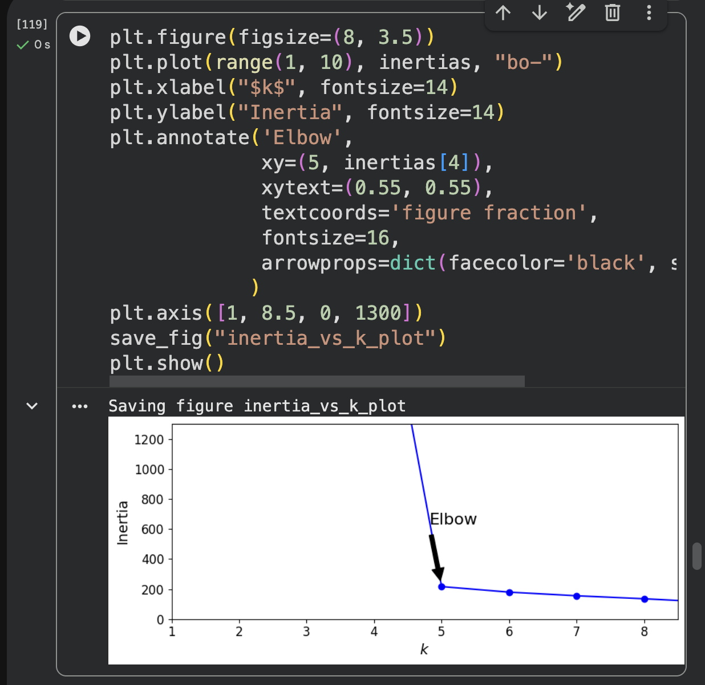
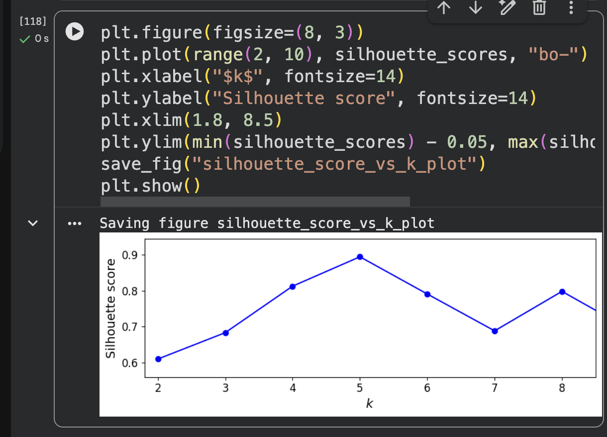

# Reporte — K-Means: blobs originales vs. blobs separados

## Entrega

- **Notebooks**:
  - Original (Géron, sin modificar): [`assets/codigo/01_K_medias_original.ipynb`](assets/codigo/01_K_medias_original.ipynb)
  - Modificado (blobs separados): [`assets/codigo/01_K_medias_new.ipynb`](assets/codigo/01_K_medias_new.ipynb)
- **Evidencia de ejecución en Colab**: las capturas de la sección de "Blobs separados" (celdas 84, 106 y 111 abajo) muestran directamente la interfaz de Google Colab (número de celda, botón de ejecución, tiempo de corrida), lo cual sirve como evidencia de que el notebook se ejecutó ahí.

## Parámetros usados

### Blobs originales (Géron)

```python
blob_centers = np.array([
    [ 0.2,  2.3],
    [-1.5,  2.3],
    [-2.8,  1.8],
    [-2.8,  2.8],
    [-2.8,  1.3]])
blob_std = np.array([0.4, 0.3, 0.1, 0.1, 0.1])
```

### Blobs separados (nuestra modificación)

```python
blob_centers_sep = np.array([
    [ 0.5,  3.0],
    [-3.0,  3.0],
    [-7.0,  1.5],
    [-7.0,  4.5],
    [-7.0, -1.5]])
blob_std_sep = np.array([0.4, 0.3, 0.1, 0.1, 0.1])
```

**Qué cambiamos y qué no:** dejamos el `blob_std` exactamente igual al original (`[0.4, 0.3, 0.1, 0.1, 0.1]`) y solo aumentamos la distancia entre los 5 centros — la separación mínima entre pares de centros pasó de 0.5 (entre los tres centros apretados de la izquierda) a 3.0. Esto fue deliberado: para poder responder la pregunta 3 del reporte necesitábamos aislar el efecto de la **distancia** sin mezclarlo con un cambio de **std**.

## Capturas

### Scatter (datos sin etiqueta)

| Original | Separado |
|---|---|
|  |  |

### Voronoi (k=5)

| Original | Separado |
|---|---|
|  |  |

### Codo (inercia vs. k)

| Original | Separado |
|---|---|
|  |  |

### Silueta (silhouette score vs. k)

| Original | Separado |
|---|---|
|  |  |

## Reporte

### 1. En los datos de Géron, ¿por qué el codo "prefiere" k=4 si `make_blobs` usó 5 centros?

Mirando el scatter original, tres de los cinco centros (`[-2.8, 1.8]`, `[-2.8, 2.8]`, `[-2.8, 1.3]`) están muy juntos entre sí (separados solo 0.5–1.0 unidades) y son muy compactos (`std=0.1`), mientras los otros dos (`[0.2, 2.3]` con `std=0.4` y `[-1.5, 2.3]` con `std=0.3`) son mucho más dispersos y se traslapan un poco entre ellos.

La inercia medida en nuestra corrida fue aproximadamente:

| k | 2 | 3 | 4 | 5 | 6 | 7 | 8 |
|---|---|---|---|---|---|---|---|
| Inercia | ~1157 | ~655 | ~225 | ~224 | ~180 | ~145 | ~127 |

El salto grande está entre k=3 (655) y k=4 (225) — ahí es donde el algoritmo logra separar el grupo de blobs dispersos (los de la derecha) de la mancha apretada de la izquierda. Pero entre k=4 (225) y k=5 (224) la inercia casi no cambia, porque dividir el grupo apretado de la izquierda en 3 sub-clusters en vez de tratarlo como 1 casi no reduce la distancia promedio (ya eran muy compactos). El método del codo se fija en **dónde deja de caer fuerte la curva**, y como el "quinto centro" no aporta una reducción significativa de inercia, el codo visual queda en k=4 aunque la verdad generadora tenga 5 centros. Esto confirma que el método del codo es sensible a la magnitud de separación/varianza relativa entre clusters, no al número real de distribuciones que generaron los datos.

### 2. Con los blobs separados, ¿el codo y la silueta coinciden en el mismo k? ¿Ese k es 5?

Sí. En la captura de la celda 106 (codo) la curva cae en picada hasta k=5 y se aplana justo después — el quiebre es visualmente en **k=5**. En la celda 111 (silueta) el score sube hasta un pico claro y luego baja. Ambos criterios coinciden exactamente en k=5, que es el número real de centros que usamos en `make_blobs`.

### 3. Si el codo sigue en 4, ¿qué falta mover: distancia entre centros vs. `blob_std`?

Lo que hay que mover es la **distancia entre centros**, no necesariamente el `blob_std`. En nuestra modificación dejamos el `blob_std` idéntico al original y solo aumentamos la separación entre los 5 centros (mínimo de 0.5 a 3.0), y esto fue suficiente para que el codo y la silueta se movieran limpiamente a k=5.
