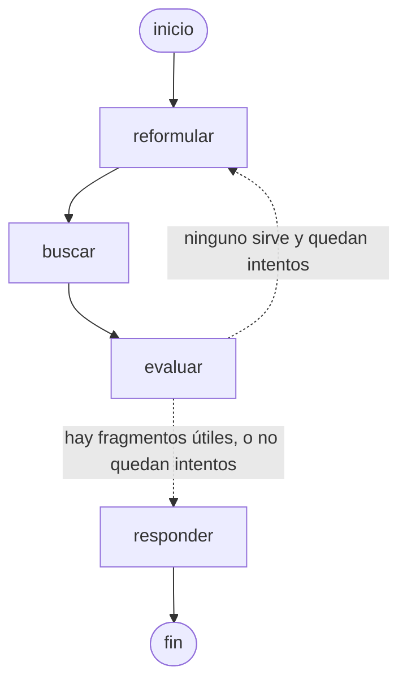

# agente/ — F3: Agente RAG con LangGraph

Responde preguntas de medicina veterinaria **solo con la biblioteca** y cita libro y página.



El diagrama sale del propio código (`grafo.get_graph().draw_mermaid()`); las líneas punteadas son
la arista condicional `decidir_siguiente`.

| Nodo | Qué hace | ¿Usa LLM? |
|---|---|---|
| `reformular` | Convierte la pregunta (y la conversación) en una consulta de búsqueda autocontenida; en el reintento, una consulta **distinta** | Sí, salida estructurada |
| `buscar` | Vectoriza la consulta con Voyage (`input_type="query"`) y trae los 8 chunks más parecidos de pgvector | No |
| `evaluar` | Decide qué fragmentos sirven (descarta otros temas y texto de OCR dañado) | Sí, salida estructurada |
| `responder` | Redacta con citas `[n]`; las **fuentes y advertencias las arma el código**, no el LLM | Sí, texto |

## Módulos

| Archivo | Responsabilidad |
|---|---|
| `estado.py` | `Estado` del grafo (`historial` se acumula con un *reducer*), `Fragmento`, `Mensaje`, `Respuesta` |
| `modelo.py` | Puerto `ModeloLenguaje` y adaptador `ModeloOpenAI` (SDK oficial, API *Responses*) |
| `recuperador.py` | Puerto `Recuperador` y adaptador `RecuperadorPgvector` (Voyage + SQL) |
| `prompts.py` | Instrucciones de cada nodo (reglas: no inventar, citar, dosis, unidades dudosas, idioma) |
| `nodos.py` | Los 4 nodos y la arista condicional `decidir_siguiente` |
| `grafo.py` | Conexión de los nodos, memoria de conversación (*checkpointer*) y la clase `Agente` |
| `__main__.py` | Chat de consola `vetrag-chat` |

**Puertos:** los nodos no saben qué LLM ni qué base de datos se usan. Para cambiar de proveedor
(o usar LangChain) basta con otro adaptador; las pruebas usan un modelo y un recuperador falsos.

## Uso

```bash
cd backend
uv run vetrag-chat      # /nuevo = conversación nueva, /salir
```

Configuración (en `backend/.env`): `VETRAG_OPENAI_API_KEY`, `VETRAG_VOYAGE_API_KEY`,
`VETRAG_DATABASE_URL`; opcionales `VETRAG_MODELO_LLM` (`gpt-5.6-luna`),
`VETRAG_ESFUERZO_RAZONAMIENTO` (`low`), `VETRAG_FRAGMENTOS_POR_BUSQUEDA` (8),
`VETRAG_MAX_BUSQUEDAS` (2).
